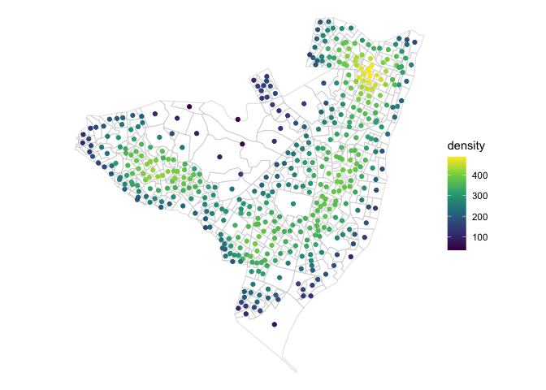
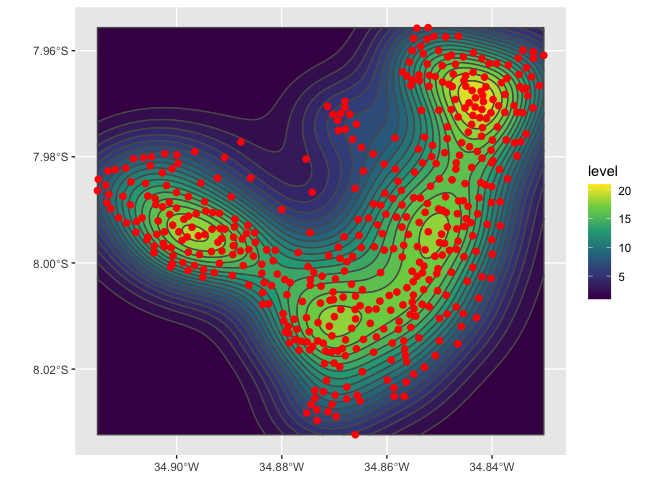

# Extra ‘sf’ Simple Features manipulations

[](https://cran.r-project.org/package=sfx)
[](https://www.tidyverse.org/lifecycle/#experimental)
[](http://www.gnu.org/licenses/gpl-2.0.html)

Still a work-in-progress – not all features are available or behave
properly (i.e. `st_density(return_geometry = "raster")`).

See the [Reference
section](http://seasmith.github.io/packages/sfx/reference/index.html)
for detailed examples.

``` r
library(sf)
## Linking to GEOS 3.9.1, GDAL 3.2.3, PROJ 7.2.1; sf_use_s2() is TRUE
library(sfx)
library(ggplot2)
library(stars) # for geom_stars() 
## Loading required package: abind

olinda1 <- sf::read_sf(system.file("shape/olinda1.shp", package = "sf"))

olinda1_centroids <- olinda1  %>%
    sf::st_centroid()
## Warning in st_centroid.sf(.): st_centroid assumes attributes are constant over
## geometries of x
```

## Point

``` r
olinda1_centroids %>%
    st_density() %>%
    ggplot() +
    geom_sf(data = olinda1, fill = NA, color = "gray80") +
    geom_sf(aes(color = density)) +
    scale_color_viridis_c() +
    theme_void()
```

    ## No bandwidth provided, using estimate: 0.0266888491366906No bandwidth provided, using estimate: 0.0218299890189734

<!-- -->

``` r
olinda1_centroids %>%
    st_density(method = "bkde2D") %>%
    ggplot() +
    geom_sf(data = olinda1, fill = NA, color = "gray80") +
    geom_sf(aes(color = density)) +
    scale_color_viridis_c() +
    theme_void()
```

    ## No bandwidth provided, using estimate: 0.00440286131103809No bandwidth provided, using estimate: 0.00457288717649596

<!-- -->

## Isoband

``` r
olinda1_centroids %>%
    st_density(return_geometry = "isoband") %>%
    ggplot() +
    geom_sf(aes(fill = level), alpha = 1) +
    geom_sf(data = olinda1_centroids, color = "red", size = 2) +
    scale_fill_viridis_c()
```

    ## No bandwidth provided, using estimate: 0.0266888491366906No bandwidth provided, using estimate: 0.0218299890189734

<!-- -->

## Raster

``` r
# NOT WORKING AS EXPECTED
olinda1_centroids %>%
    st_density(return_geometry = "raster", n = 50) %>%
    # use lambda expr to target . inside geom_stars or
    # else ggplot() will error on fortify() attempt
    {
      ggplot() +
        geom_stars(data = .) +
        coord_equal() +
        theme_void() +
        scale_fill_viridis_c() +
        scale_x_discrete(expand = c(0, 0)) +
        scale_y_discrete(expand = c(0, 0))
    }
```

    ## No bandwidth provided, using estimate: 0.0266888491366906No bandwidth provided, using estimate: 0.0218299890189734

<!-- -->

## Current Functions

``` r
# Density estimation (kernel based)
st_density

# Convert logical matrix to logical vector
st_any

# Binary logical helpers
st_any_contains
st_any_contains_properly
st_any_covered_by
st_any_covers
st_any_crosses
st_any_disjoint
st_any_equals
st_any_equals_exact
st_any_intersects
st_any_is_within_distance
st_any_overlaps
st_any_touches
st_any_within

# Joins
st_inner_join
st_left_join
st_anti_join
st_semi_join

# Unitless dimensions
st_ul_area
st_ul_distance
st_ul_length

# Bounding-box helpers
st_extent
st_xdist
st_ydist
st_xlim
st_ylim
```

## Future Functions?

``` r
geom_sf_density()
plot_sf_density()
```
