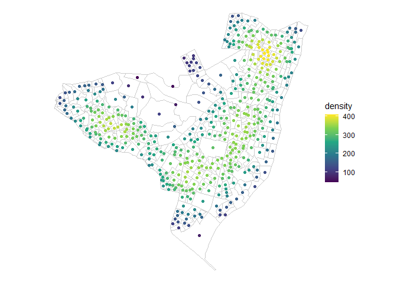
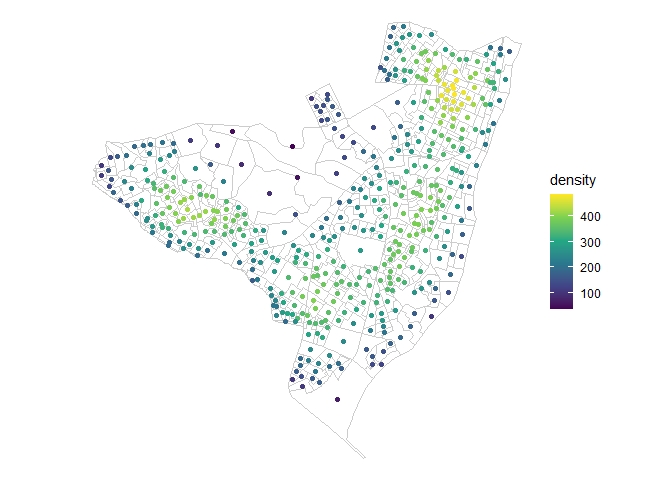
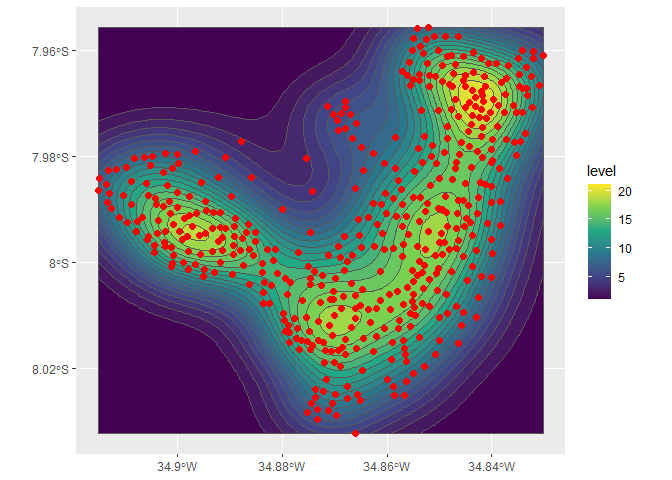

# Extra ‘sf’ Simple Features manipulations

[](https://cran.r-project.org/package=sfx)
[](https://www.tidyverse.org/lifecycle/#experimental)
[](http://www.gnu.org/licenses/gpl-2.0.html)

Still a work-in-progress – not all features are available
(i.e. `st_density(return_geometry = "raster")`).

See the [Reference
section](http://seasmith.github.io/packages/sfx/reference/index.html)
for detailed examples.

``` r
library(sf)
## Linking to GEOS 3.6.1, GDAL 2.2.3, PROJ 4.9.3
library(sfx)
library(ggplot2)

olinda1 <- sf::read_sf(system.file("shape/olinda1.shp", package = "sf"))

olinda1_centroids <- olinda1  %>%
    sf::st_centroid()
## Warning in st_centroid.sf(.): st_centroid assumes attributes are constant over
## geometries of x
## Warning in st_centroid.sfc(st_geometry(x), of_largest_polygon =
## of_largest_polygon): st_centroid does not give correct centroids for longitude/
## latitude data

olinda1_centroids %>%
    st_density() %>%
    ggplot() +
    geom_sf(data = olinda1, fill = NA, color = "gray80") +
    geom_sf(aes(color = density)) +
    scale_color_viridis_c() +
    theme_void()
## No bandwidth provided, using estimate: 0.0266888485440378No bandwidth provided, using estimate: 0.0218299889056418
```

<!-- -->

``` r

olinda1_centroids %>%
    st_density(method = "bkde2D") %>%
    ggplot() +
    geom_sf(data = olinda1, fill = NA, color = "gray80") +
    geom_sf(aes(color = density)) +
    scale_color_viridis_c() +
    theme_void()
## No bandwidth provided, using estimate: 0.00440286118167917No bandwidth provided, using estimate: 0.00457288709889236
```

<!-- -->

``` r

olinda1_centroids %>%
    st_density("isoband") %>%
    ggplot() +
    geom_sf(aes(fill = level), alpha = 1) +
    geom_sf(data = olinda1_centroids, color = "red", size = 2) +
    scale_fill_viridis_c()
## No bandwidth provided, using estimate: 0.0266888485440378No bandwidth provided, using estimate: 0.0218299889056418
```

<!-- -->

Function list:

``` r
# Density estimation (kernel based)
st_density

# Convert logical matrix to logical vector
st_any

# Binary logical helpers
st_any_contains
st_any_contains_properly
st_any_covered_by
st_any_covers
st_any_crosses
st_any_disjoint
st_any_equals
st_any_equals_exact
st_any_intersects
st_any_is_within_distance
st_any_overlaps
st_any_touches
st_any_within

# Joins
st_inner_join
st_left_join
st_anti_join
st_semi_join

# Unitless dimensions
st_ul_area
st_ul_distance
st_ul_length

# Bounding-box helpers
st_extent
st_xdist
st_ydist
st_xlim
st_ylim
```
